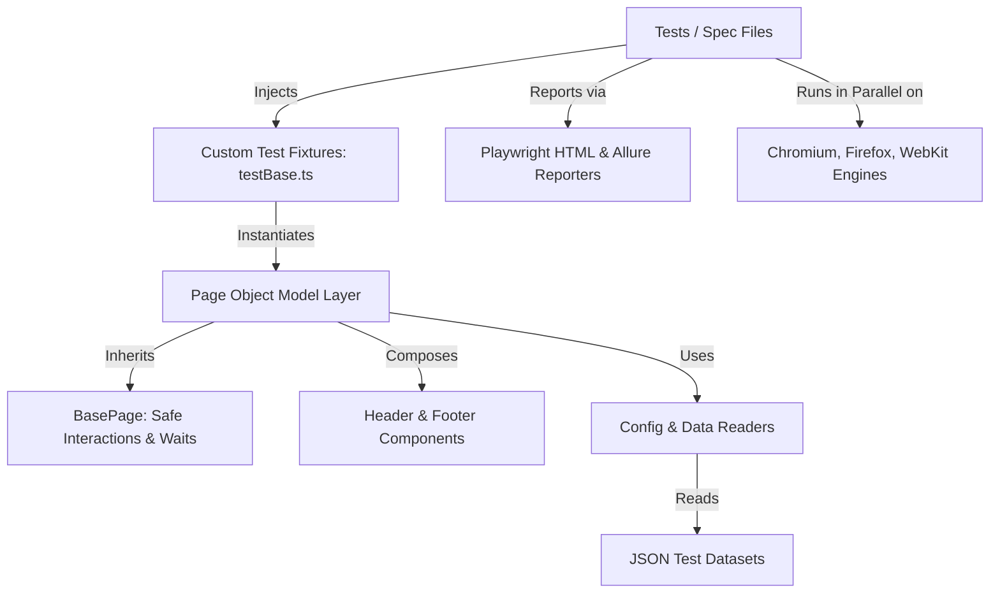

# Enterprise Modern Web UI Automation Framework

[](https://github.com/organization/playwright-enterprise-automation/actions/workflows/playwright.yml)
[](https://www.typescriptlang.org/)
[](https://playwright.dev/)

An enterprise-ready, production-grade test automation framework built with **Playwright** and **TypeScript**, engineered with clean Page Object Model (POM) patterns, component abstractions, data-driven test architectures, cross-browser parallelism, flaky test mitigations, and automated CI/CD workflows.

---

## 🏛️ Architecture Overview



### Key Highlights
- **Engine**: Playwright with TypeScript for resilient, high-speed, asynchronous browser automation.
- **Page Object Model (POM)**: Strict separation of concerns between test logic and UI locators/actions.
- **Component Abstraction**: Modular UI components (`HeaderComponent`, `FooterComponent`) reused across pages.
- **Custom Fixtures**: Eliminates setup boilerplate and provides pre-authenticated contexts (`loggedInPage`).
- **Data-Driven Architecture**: Decoupled test datasets for user personas, error states, and e-commerce catalogue validation.
- **Flaky Test Mitigation**: Web-first assertions, auto-waiting, dynamic timeouts, network idle checks, and retry policies.
- **Rich Dual Reporting**: Built-in Playwright HTML Report with failure traces, screenshots, and video recordings, plus Allure Report integration.
- **CI/CD Ready**: Pre-configured GitHub Actions workflow executing cross-browser test matrices on Pull Requests.

---

## 📂 Project Structure

```
.
├── .github/
│   └── workflows/
│       └── playwright.yml             # GitHub Actions CI matrix workflow
├── src/
│   ├── config/
│   │   └── environment.ts             # Centralized environment constants & timeouts
│   ├── data/
│   │   ├── users.json                 # Authentication personas (valid & negative cases)
│   │   ├── products.json              # Product catalogue & sort filter expectations
│   │   └── checkoutData.json          # Form inputs and edge-case scenarios
│   ├── fixtures/
│   │   └── testBase.ts                # Extended Playwright fixture injecting POMs & auth
│   ├── pages/
│   │   ├── BasePage.ts                # Base class with safe interactions & logging
│   │   ├── LoginPage.ts               # Login page locators and actions
│   │   ├── InventoryPage.ts           # Product catalog, sorting, and cart actions
│   │   ├── ItemDetailsPage.ts         # Individual product view
│   │   ├── CartPage.ts                # Shopping cart item management
│   │   ├── CheckoutStepOnePage.ts     # Information input step
│   │   ├── CheckoutStepTwoPage.ts     # Order overview and tax/total calculations
│   │   ├── CheckoutCompletePage.ts    # Order dispatch confirmation screen
│   │   └── components/
│   │       ├── HeaderComponent.ts     # Header navigation, burger menu, cart badge
│   │       └── FooterComponent.ts     # Footer social links and copyright
│   └── utils/
│       ├── dataReader.ts              # Strongly typed JSON/CSV loader
│       └── logger.ts                  # Structured logging integrated with test.step
├── tests/
│   ├── auth.spec.ts                   # Login, logout, and data-driven negative auth tests
│   ├── inventory.spec.ts              # Catalogue verification & multi-attribute sorting
│   ├── cart.spec.ts                   # Cart badge counter, item addition and deletion
│   ├── checkout.spec.ts               # Full E2E purchase journey with tax calculation
│   └── errorHandling.spec.ts          # Form validation errors and cancellation paths
├── .env.example                       # Environment configuration template
├── package.json                       # Dependencies and test execution scripts
├── playwright.config.ts               # Cross-browser, timeout, worker, and reporting settings
└── tsconfig.json                      # Strict TypeScript and path mapping configuration
```

---

## 🚀 Quick Start

### 1. Prerequisites
- **Node.js**: `v18+` (Tested on `v22.x`)
- **npm**: `v9+` (Tested on `v10.x`)

### 2. Installation
```bash
# Clone the repository
git clone <repository-url>
cd "Mobile Automation UI"

# Install dependencies
npm install

# Install Playwright browser binaries
npx playwright install chromium firefox webkit
```

### 3. Environment Setup
Copy `.env.example` to `.env` (already configured by default):
```bash
cp .env.example .env
```

---

## 🧪 Test Execution Commands

| Command | Description |
| :--- | :--- |
| `npm run test` | Run all test suites across configured browsers in parallel |
| `npm run test:chromium` | Run tests exclusively on Chromium (Google Chrome engine) |
| `npm run test:firefox` | Run tests exclusively on Firefox |
| `npm run test:webkit` | Run tests exclusively on WebKit (Apple Safari engine) |
| `npm run test:headed` | Run tests with browser UI visible |
| `npm run test:smoke` | Run critical smoke tests tagged with `@smoke` |
| `npm run test:e2e` | Run End-to-End checkout scenarios |
| `npm run test:debug` | Open Playwright Inspector for step-by-step test debugging |
| `npm run typecheck` | Run TypeScript compiler type checking |

---

## 📊 Reporting & Debugging Artifacts

### 1. Playwright HTML Report
After test execution, launch the interactive HTML report:
```bash
npm run report
```
The report includes:
- Test execution duration, status, and retry history
- Step-by-step logs with exact timestamps
- Automatic screenshots on failed steps
- Video recordings of failed test runs
- Embedded Playwright **Trace Viewer** links for inspection

### 2. Playwright Trace Viewer
To inspect a recorded execution trace (DOM snapshots, network traffic, console logs, and action timeline):
```bash
npx playwright show-trace test-results/<test-dir>/trace.zip
```

### 3. Allure Report
```bash
# Generate Allure report
npm run allure:generate

# Open interactive Allure report in browser
npm run allure:open
```

---

## 🛡️ Flaky Test Mitigation Strategies

1. **Web-First Assertions**: All page assertions leverage Playwright's built-in retry mechanism (e.g., `await expect(locator).toBeVisible()`), retrying until the condition passes or timeout is reached.
2. **Auto-Waiting Locators**: Page actions (`click`, `fill`) automatically wait for actionable states (visible, stable, enabled, editable) before dispatching events.
3. **Smart Dynamic Timeouts**: Action timeouts (10s), navigation timeouts (15s), and test timeouts (45s) are configured to accommodate variable network latency.
4. **Resilient Locators**: Elements utilize user-facing and resilient test attributes (`[data-test="..."]`, `getByRole`) rather than brittle CSS/XPath selectors.
5. **Session Isolation**: Each test executes in an isolated browser context, preventing state leakage or session collisions.

---

## 🔄 CI/CD Integration (GitHub Actions)

The repository includes a production-ready GitHub Actions workflow (`.github/workflows/playwright.yml`) which:
- Triggers automatically on Pull Requests and pushes to `main`/`master`.
- Runs a matrix across `chromium`, `firefox`, and `webkit` in parallel.
- Automatically captures and uploads test reports and failure artifacts (traces, screenshots, videos) as workflow artifacts with a 14-day retention period.
